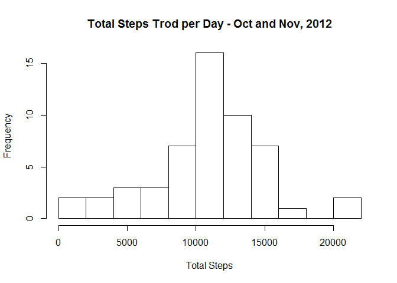
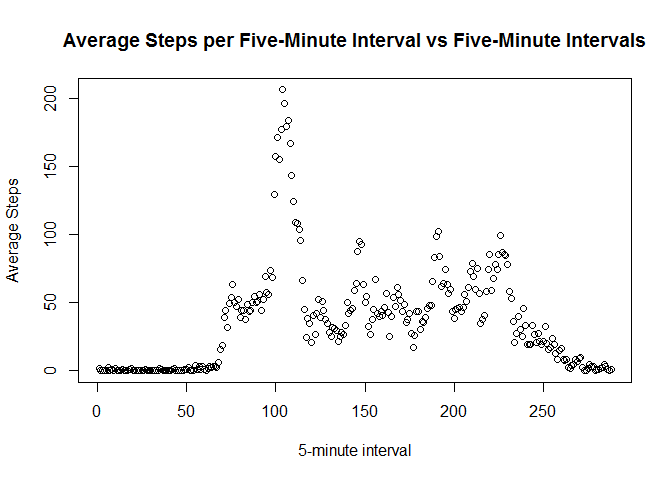
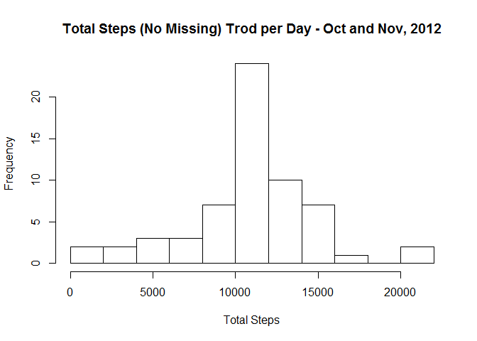
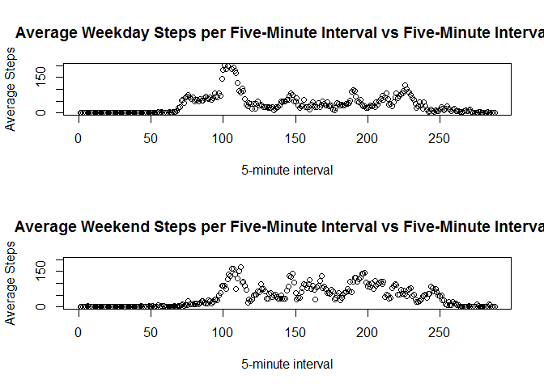

# Reproducible Research: Peer Assessment 1


## Loading and preprocessing the data


```r
library(dplyr)
```

```
## 
## Attaching package: 'dplyr'
## 
## The following objects are masked from 'package:stats':
## 
##     filter, lag
## 
## The following objects are masked from 'package:base':
## 
##     intersect, setdiff, setequal, union
```

```r
#Read data from working directory       
stepdata <- read.csv("activity.csv", stringsAsFactors = FALSE)

#Replace unevenly spaced stepdata$interval with 1:288 for each day (there are 288 five minute intervals in a day) 
index <- rep(1:288,61)

#bind this to the data frame
stepdata <- cbind(stepdata,index)

#Convert stepdata$date to date format
stepdata$date <- as.Date(stepdata$date)
```

## What is mean total number of steps taken per day?


```r
#Calculate total steps per day and output as histogram
totalsteps <- aggregate(steps ~ date, data = stepdata, sum)      
hist(totalsteps$steps,15,main = "Total Steps Trod per Day - Oct and Nov, 2012", xlab = "Total Steps") 
```

 

```r
#calculate the mean and median of the total steps per day
meansteps <- mean(totalsteps$steps)
mediansteps <- median(totalsteps$steps)
```

**The mean number of steps per day = 10766.19.  
The median number of steps per day = 10765.**


## What is the average daily activity pattern?


```r
#calculate the mean number of steps within the 5-minute intervals (index)
meansteps <- aggregate(steps ~ index, data = stepdata, mean)
#plot the time series (index = 1:288)
with(meansteps, plot(index, steps, main = "Average Steps per Five-Minute Interval vs Five-Minute Intervals", xlab = "5-minute interval", ylab = "Average Steps"))
```

 

```r
#determine which index has the highest number of steps and the value at that index
maxindex <- which.max( meansteps$steps )
maxvalue <- meansteps$steps[maxindex]
```

**The maximum number of steps, on average, in a five-minute interval is 206.17.  
The maximum occurs at the 104th interval. ** 


## Imputing missing values

```r
#calculate the total number of missing values in the steps variable
sumna <- sum(is.na(stepdata$steps))
```
**The number of missing values in the data set is 2304.**


```r
#impute missing values as the mean for the appopriate 5-minute interval (calculated above)
longmean = rep(meansteps$steps,61)  #line up the index variable correctly, repeat for the 61 days
nomisssteps <- stepdata
#impute the missing values
nomisssteps$steps[which(is.na(nomisssteps$steps))] <- longmean[which(is.na(nomisssteps$steps))]

#Calculate total steps per day and output as histogram
totnomisssteps <- aggregate(steps ~ date, data = nomisssteps, sum)      
hist(totnomisssteps$steps,15,main = "Total Steps (No Missing) Trod per Day - Oct and Nov, 2012", xlab = "Total Steps") 
```

 

```r
#Calculate the mean and median of the total steps with the no mmissing values data set
meannosteps <- mean(totnomisssteps$steps)
mediannosteps <- median(totnomisssteps$steps)
```


**The mean number of steps per day = 10766.19.  
The median number of steps per day = 10766.19.  
The mean is the same as the mean with missing values and the median has increased by 1.2 steps.**


## Are there differences in activity patterns between weekdays and weekends?


```r
#determine which dates are weekdays and weekends 
dayswk <- weekdays(nomisssteps$date)

#label weekends
wkend <- c("Saturday","Sunday")

#label those dates that are weekdays and weekends
nomisssteps <- mutate(nomisssteps, daytype = ifelse(dayswk %in% wkend, "weekend", "weekday"))
#convert daytype to a factor
nomisssteps$daytype <- as.factor(nomisssteps$daytype)
#calculate the mean number of steps within the 5-minute intervals (index)
meannosteps <- aggregate(steps ~ index + daytype, data = nomisssteps, mean)

#plot the time series for weekdays and weekends
par(mfrow = c(2,1))

#plot the time series (index = 1:288)
with(meannosteps, plot(index[daytype == "weekday"], steps[daytype == "weekday"], main = "Average Weekday Steps per Five-Minute Interval vs Five-Minute Intervals", xlab = "5-minute interval", ylab = "Average Steps", ylim = c(0, 200)))

with(meannosteps, plot(index[daytype == "weekend"], steps[daytype == "weekend"], main = "Average Weekend Steps per Five-Minute Interval vs Five-Minute Intervals", xlab = "5-minute interval", ylab = "Average Steps", ylim = c(0, 200)))
```

 
